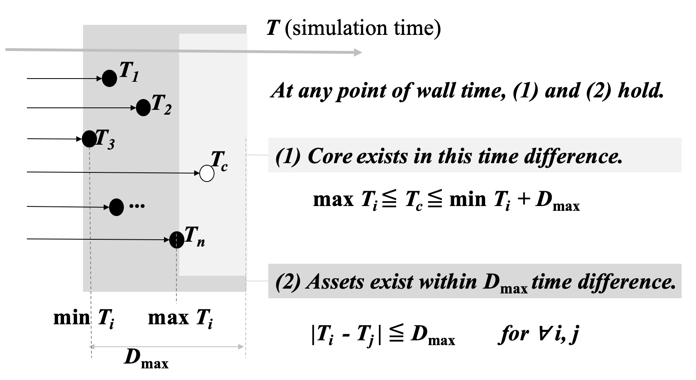

# 変更履歴

**最新版はこちらの main ブランチとします。**
https://github.com/toppers/hakoniwa-core-cpp-client/blob/main/math/README.md

- (Version 3.1) https://github.com/toppers/hakoniwa-px4sim/issues/340 , issue #69 箱庭時刻同期の数学的証明より移動
- (Version 3.2) https://github.com/toppers/hakoniwa-core-cpp-client/issues/69#issue-2541993494 より移動

#   概要

箱庭は、複数のシミュレータを繋いで連携動作させるシミュレーションハブである。本簡易論文では、箱庭の中心モジュールであるである箱庭コア（以降コア）と各シミュレータ（以降アセット）間の時刻同期の考え方を公理的に定義し、それによって、各シミュレータが独自に動作していても、全アセットがあらかじめ設定された最大許容遅延時間内で同期されていることを数学的に証明する。

さらに、行われた定式化をシミュレーション実験結果と比較し、結論の正当性を確認する。さらに、定式化とシミュレーションに基づいて、なるべく早くシミュレーションが進むようなパラメータの設定についても統計的に考察する。

# 定義

以下に、問題の置かれている環境、条件、想定、および、変数名等を定義する。

## コアとアセット

箱庭全体システムは、1つのコアと複数のアセットからなる。

- コア ( $Core$ )： 箱庭のコアであり、自分のシミュレーション時刻を持ちながら全体のタクト（指揮棒）を担当する。
- アセット( $Asset$ )： 各（サードパーティ製を含む）シミュレータ。サードパーティのシミュレータは、コアとの小さな通信インターフェイスを作成することによってアセット化され、コアと通信する。アセットは、独自のシミュレーション時刻を内部に持っている。

シミュレータの特性上、実時間よりも速く進む時間を使うことで、実世界での実験よりも高速にシミュレーションを行う、といった利用法が想定される。例えば、実時間では1日かかるシミュレーションが10秒で完了する、などの利点がある。

コアとアセットは、同一あるいはネットワーク接続された計算機上のソフトウェアによる実現を前提としており、それぞれの内部にシミュレーション時刻を保有している。また、両者は通信やメモリにより、自由なタイミングにて、お互いの時刻を知ることができる。コアは $1$ つ。アセットは全部で $n$ 個あり、 $1 \ldots n$ の番号が振られている。

## シミュレーション時刻とウォール時刻

実世界の時刻をウォール時刻 $t$ と呼ぶ。 $t$ は、NTP(Network Time Protocol)等により、（場合によっては複数の）計算機において、今回の議論で問題にならない正確さで同期してる。また、コアとアセットはそれぞれ、任意の現在ウォール時刻 $t$ で自身もしくはコアの内部シミュレーション時刻を知ることができる。ウォール時刻には、小文字の $t$ を、シミュレーション時刻には、大文字の $T$ を使うことにする。

- $t$ - ウォール時刻（実世界の時刻）。独立変数。
- $T_c(t)$ - ウォール時刻 $t$ におけるコアのシミュレーション時刻。 $t$ の従属変数。
- $T_i(t)$ - ウォール時刻 $t$ におけるアセット $i$ のシミュレーション時刻（ $i = 1 \ldots n$ ）。 $t$ の従属変数。

これらは、すべて正の実数（ $t \in \mathbb{R}, t \geq 0$ ）として以下議論するが、実際の計算機上では十分な精度を持った整数型もしくは、浮動小数点型として保持する。

さらに、シミュレーション時刻の更新について、以下の仮定を置く。

## カウントアップ

- コアおよびアセットは、それぞれ一定ウォール時間間隔で自己のシミュレーション時刻を更新する。この動作を「カウントアップ」という。
- カウントアップは、コアおよびアセット自身にそれぞれ定義されたウォール時間間隔 $\Delta t_c, \Delta t_i$ で行われる。
- カウントアップ時には、「他者の時刻を取得」し、「自己の時刻を修正」する。その際、お互いの時刻は遅れなく瞬時に知ることができる。
- 1回のカウントアップ時に更新（前回時刻への追加）されるシミュレーション時間間隔は、 コア、アセットそれぞれ、 $\Delta T_c \gt 0, \Delta T_i  \gt 0$  （進行: progress）、もしくは $0$（停留: retain） である。

この仮定により、それぞれのシミュレーション時刻は、踊り場を持つ階段状に、一定上昇幅で広義短調増加する。

# カウントアップと規則

動機は、 $n$ 個のアセットとコアのシミュレーション時刻を、想定される範囲内で同期させることである。
具体的には、アセットはコアより早く進むことはなく、コアはアセットよりも許容時間幅を超えて早く進むことはないようにしたい。そのめに、カウントアップ時には以下の規則を設ける。

コアとアセットのシミュレーション時刻ずれの許容時間間隔を、「最大許容遅延時間」 $d_{max}$ として定義する。

- $d_{max}$ - 最大許容遅延時間(Maximum Delay Tolerance)

### 初期状態の一致

$$
T_i(0) = T_c(0) = 0  \ldots 初期においてすべてのアセット i とコアのシミュレーション時刻は一致している。
$$

### アセットのシミュレーション時刻更新規則

各アセット $i = 1 \ldots n$ は、以下の更新規則に従う。

ウォール時刻 $t$ において、前回シミュレーション時刻 $T_i(t - \Delta t_i)$ と現在のコアシミュレーション時刻 $T_c(t)$ から、新しいシミュレーション時刻 $T_i(t)$ を決定する。

新シミュレーション時刻 $T_i(t)$は、前シミュレーション時刻を規定幅 $\Delta T_i$ だけ進めたと想定した値（想定次時刻 $T\prime_i(t)$ ）が、コアの現時刻 $T_c(t)$ を追い越さないように確定する。

- カウントアップ間隔

$$
\Delta t_i \ldots ウォール時間間隔（ i 毎に異ってよい）
$$

- 1 回の時刻増加幅

$$
0 もしくは \Delta T_i \ldots シミュレーション時間間隔（ i 毎に異なってよい）
$$

- 想定新時刻

$$
T_i\prime(t) = T_i(t - \Delta t_i) + \Delta T_i
$$

- 確定新時刻
 
$$
T_i(t)  =
\begin{cases}
T_i\prime(t)  & (T_i\prime(t)  \leq T_c(t) の時) \ldots 進行 \\
T_i(t - \Delta t_i) & (T_i\prime(t) \gt T_c(t) の時) \ldots 停留(※note: ここで T_c(t) まで進行させる案もある)
\end{cases}
$$

- アセット時刻更新における保存則

上記ルールによって、すべてのアセット $i$ について以下の不等式が、すべてのウォール時刻 $t$ について成り立つ。

$$
T_i(t)  \leq T_c(t) \ldots (a.1)
$$

すなわち、

$$
\max_{i = 1 \ldots n} T_i(t) \leq T_c(t) \ldots (a.2)
$$

- 証明

初期条件および確定新時刻の更新アルゴリズムから、数学的帰納法によっていかなるカウントアップ時 $t = 0,  \Delta t_i, 2 \Delta t_i, \ldots$ においても、(a.1) は維持される。また、関数 $T_i(t)$ がカウントアップ時以外の領域では定数関数であることから、(a.1) は任意の $t \geq 0$ について成り立つ。

ここでは、 $\Delta t_i$ は固定としてるが、ウォール時間点列として、単調増加な数列として、 $t = 0, t_i, t_2, \ldots$ を取れば同様の証明ができる。

(a.2) は (a.1) の $i$ による総称を $\max$ を使った表記に書き換えたのみ。

### コアのシミュレーション時刻更新ルール

コアも同様に、ウォール時刻 $t$ において、前回シミュレーション時刻 $T_c(t - \Delta t_c)$ と $n$ 個のアセットシミュレーション時刻 $T_i(t) (i = 1 \ldots n)$ から、自身の新しいシミュレーション時刻 $T_c(t)$ を決定する。

新シミュレーション時刻 $T_c(t)$は、前シミュレーション時刻を規定幅 $Delta T_c$ だけ進めたと想定した値（想定次時刻 $T_c\prime(t)$ ）が、すべてのアセットの現時刻 $T_i(t)$ を許容幅 $d_{max} $ 以上追い越さないように確定する。

- カウントアップ間隔

$$
\Delta t_c \ldots  ウォール時間間隔
$$

- 1 回の時刻増加幅

$$
0 もしくは \Delta T_c \ldots  シミュレーション時間間隔
$$

カウントアップの際、次時刻値は、コアの現時刻を進めたと想定した値（想定次時刻）が、アセットの現時刻より **最大許容遅延時間 $d_m$ を超えて進んでしまわないように** 確定する。

- 想定新時刻

$$
T_c\prime(t) = T_c(t - \Delta t_c) + \Delta T_c
$$

- 想定最大遅延幅

$$
d\prime_{max} = \max_{i = 1 \ldots n}(T_c\prime(t) - T_i(t))
$$

- 確定新時刻

$$
T_c(t)  =
\begin{cases}
T_c\prime(t)  & (d\prime_{max}  \leq d_{max} の時) \ldots 進行 \\
T_c(t - \Delta t_c) & (d\prime_{max} \gt d_{max} の時) \ldots 停留
\end{cases}
$$

- コア時刻更新における保存則

上記規則によって、すべてのアセット $i$ について以下の不等式が、すべてのウォール時刻 $t$ について成り立つ。

$$
T_c(t)  \leq T_i(t) + d_{max} \ldots (c.1)
$$

すなわち、

$$
T_c(t)  \leq \min_{i = 1 \ldots n}  T_i(t) + d_{max} \ldots (c.2)
$$

- 証明

初期条件および確定新時刻の更新アルゴリズムにから、数学的帰納法によっていかなるいかなるカウントアップ時 $t = 0, \Delta t_c,  2\Delta t_c, \ldots$ においても、(c.1) は維持される。また、関数 $T_c(t)$ がカウントアップ時以外の領域では定数関数であることから、(c.1) は任意の $t \geq 0$ について成り立つ。

ここでは、 $\Delta t_c$ は固定としてるが、ウォール時間点列として、単調増加な数列として、 $t = 0, t_i, t_2, \ldots$ を取れば同様の証明ができる。

(c.2) は (c.1) の $i$ による総称を $\min$ を使った表記に書き換えたのみ。

# シミュレーション時刻について得られた結論

前述した2つの等式を再掲する。 これらは、 $t \leq 0$ について恒等的に成立する。

- どのアセットのシミュレーション時刻も、コアのシミュレーション時刻より進んでいない。

$$
\max_{i = 1 \ldots n} T_i(t) \leq T_c(t) \ldots (a.2)
$$

- コアのシミュレーション時刻は、どのアセットのシミュレーション時刻より、最大許容遅延時間を超えて進んでいない。

$$
T_c(t)  \leq \min_{i = 1 \ldots n}  T_i(t) + d_{max} \ldots (c.2)
$$

この2つの命題より、次の2つの重要な命題がなりたつ。これが本小論文の結論である。

- コアのシミュレーション時刻は、最も進んだアセット時刻より遅れておらず、最も遅れたアセット時刻より最大許容遅延時間を超えて進んでいない。

$$
\max_{i = 1 \ldots n} T_i(t) \leq T_c(t) \leq \min_{i = 1 \ldots n}  T_i(t) + d_{max} \ldots (c.3)
$$

さらに、この不等式の中央にある $T_c(t)$ を省くことで、すべてのアセットのペア $(i, j)$ について以下が言える。

- 最も進んだアセットと最も遅れたアセットのシミュレーション時刻差は、高々最大許容遅延時間である、

$$
\max_{i = 1 \ldots n} T_i(t) \leq \min_{i = 1 \ldots n}  T_i(t) + d_{max} \ldots (a.4)
$$

すなわち、言い換えると、

- どんなアセットのペア $(i, j)$ を選んでも、シミュレーション時刻差は最大許容時間以内である。

$$
| T_i(t) - T_j(t) | \leq d_{max}  \quad  for \quad \forall i, j \ldots (a.5)
$$

これは、コアのシミュレーション時刻を調停役（タクト）にして、お互いに直接干渉し合わない別々のアセットが、最大許容遅延時間以内で調歩同期していると言える。

# 実験結果

$10$ 個のアセットを動作させたときのシミュレーション結果を示す。

# パラメータについての考察

パラメータの設定によって、シミュレーション時間にはトレードオフが発生する。

## TODO:
- 森さんの実験結果と突合し、 $\Delta t_i, d_{max}, \Delta T_i, \Delta T_c$ などのパラメータをどのように調整すると、早くシミュレーションが進む考察する。
- 統計、確率分布的な考察
  

以上
